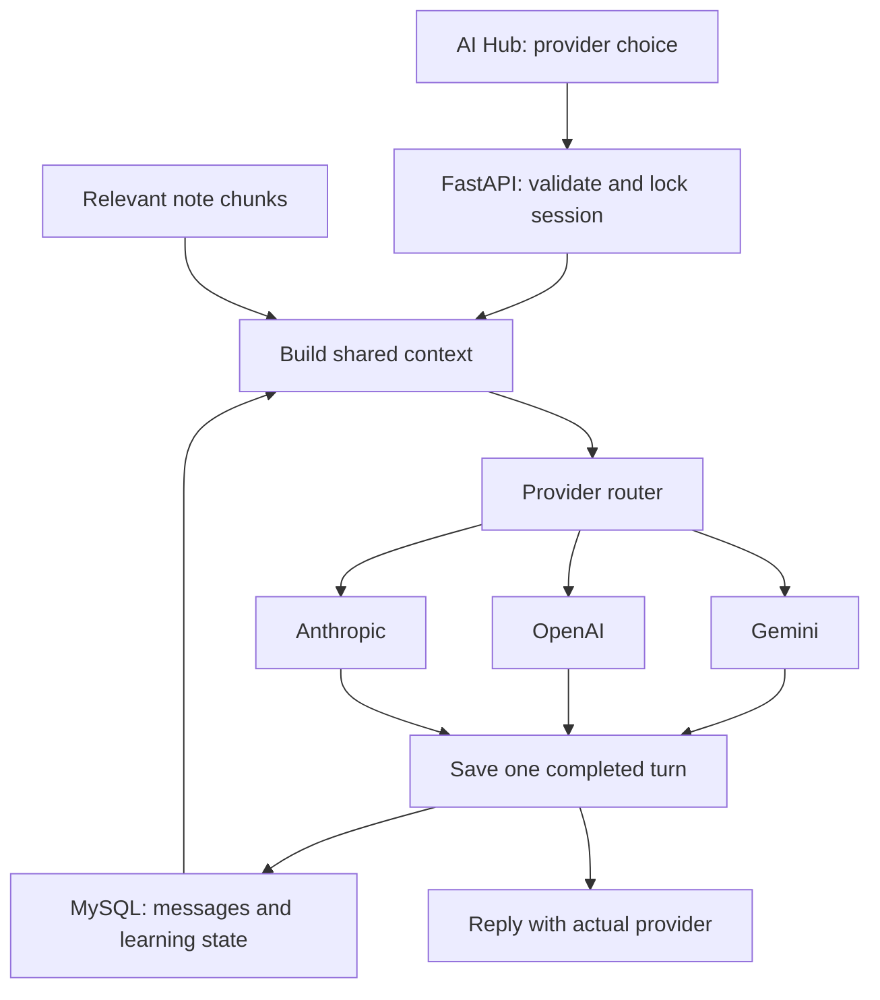

# ConceptBridge — revised technical blueprint

## Product contract

ConceptBridge helps MBA, BBA, MCA and BCA students learn concepts, apply them to practical questions, and improve code. Every journey follows material → attempt → feedback → fresh practice. Videos provide an additional explanation when a learner is stuck.

The AI Hub offers Auto, GPT, Gemini and Claude through developer APIs. ConceptBridge stores the learning session; the next model receives an explicit context package rather than another provider's private session ID or hidden reasoning.

## Stack decisions

| Layer | Decision |
|---|---|
| Frontend | Next.js + React + Tailwind; implement after the backend milestone |
| Backend | FastAPI + Python |
| Main database | MySQL + SQLAlchemy/PyMySQL |
| API testing | Thunder Client in VS Code |
| Provider clients | OpenAI Responses, Gemini generateContent, Anthropic Messages |
| File storage | Local files for development; S3/cloud storage later |
| Retrieval now | Page-aware text chunks and bounded lexical matching |
| Semantic retrieval next | FAISS or Chroma; metadata and ownership remain in MySQL |
| Authentication | Required before any real multi-student deployment; deferred from this local build |
| Deployment | Later: Next.js frontend hosting plus a Python backend service and managed MySQL |

The earlier Cloudflare/D1 preview direction is not the backend architecture for this revised project. This package uses the selected FastAPI/MySQL approach.

## One request

Auto follows the configured real-provider order. It skips missing credentials and may switch after a recoverable failure. Explicit selection stays with that provider unless the request enables fallback. Refusals and invalid requests stop; they are not bypassed through another model.

## Data and continuity

| Tables | Purpose |
|---|---|
| users, courses, learning_sessions | Existing session ownership and study context |
| messages | Canonical visible conversation text |
| chat_turns | Explicit turn ordering, request IDs, request fingerprints and replayable responses |
| session_memory | Pinned learning state, next turn counter and recap cursor |
| provider_calls | Actual successful provider/model, reported tokens, nullable cost and route events |
| documents, document_chunks, session_documents | Uploaded content metadata, page-aware chunks and session attachments |
| practice_attempts, mistakes | Evidence from attempts and follow-up practice |
| video_segments | Curated video metadata, topic, evidence and start/end offsets |

The original learning_state and ai_usage tables remain in place for compatibility. This upgrade does not claim calibrated mastery from raw chat. New usage goes to provider_calls, because a zero cost would be misleading when pricing is unknown.

Context uses pinned learning state, the extractive recap, up to eight recent messages, relevant note chunks, and the current question. The lexical MVP inspects at most 800 attached chunks per request. A UTF-8 byte budget provides a conservative size bound; it is not an exact tokenizer count. Newest input is rejected with a helpful error if it cannot fit; it is not silently cut off. Full messages remain in MySQL.

The recap is an extractive rolling record. It can omit details. A later semantic summarizer and retrieval over older messages should improve long sessions; no lossless or identical-model-behavior guarantee is made.

MySQL row locks serialize new turns for one session. A completed repeated request ID replays its stored result. A failed provider call rolls back the turn. Exactly-once charging by an external AI provider cannot be guaranteed when a provider succeeds but the network or database fails before the result is committed.

## Delivery milestones

| Milestone | Current state | Completion gate |
|---|---|---|
| 1. Foundation | Implemented and tested with a database test double | Run `/ready` and `tests.mysql_smoke` against real MySQL |
| 2. Real AI | All three adapters implemented; mocked routing tests pass | Configure Gemini and make one real call, then verify a two-provider handoff |
| 3. Learning memory | Pinned state, bounded history, extractive recap and retries implemented | Review a long real tutoring session for continuity |
| 4. Notes/RAG | PDF/TXT extraction and lexical chunk retrieval implemented | Add embeddings and evaluate retrieval against faculty notes |
| 5. Learning engine | Representative theory, numerical, CSV and code checks implemented | Validate subject answer banks and expand rubric-based practice |
| 6. Video resources | Curated segment storage and URLs implemented | Add reviewed videos; later evaluate timestamp alignment on available transcripts |
| 7. Frontend | Revised Next.js integration is the next UI milestone | All three journeys use the same session and AI Hub; labels show the actual provider |
| 8. Accounts and credits | Deferred | Authentication, ownership enforcement, budgets, encrypted BYOK and production secret management |

## YouTube workflow

The short MVP path is to curate a small set of real videos and manually review their intervals. Save the video ID, topic, start/end seconds and supporting evidence. Do not ask an LLM to invent timestamps from a title.

For automatic matching later: retrieve real video candidates; obtain legitimately available, time-aligned captions or creator-provided transcripts; chunk by time; match the concept; show the matching passage; require a review step before treating the segment as verified. A title search alone is insufficient timestamp evidence. Retain fallback text explanations when a video is removed, cannot be embedded or has no usable captions.

## First live milestone

1. Run the included backend against MySQL in mock mode.
2. Confirm persistence, replay protection and memory using Thunder Client.
3. Configure Gemini on the server and receive a real answer.
4. Configure a second provider and switch within the same session.
5. Connect the Next.js learning workspace to these validated endpoints.

## Technical references checked

- OpenAI Responses and structured outputs: https://developers.openai.com/api/docs/guides/structured-outputs
- Gemini API request shape and native multi-turn contents: https://ai.google.dev/api/generate-content
- Anthropic error classes: https://platform.claude.com/docs/en/api/errors
- SQLAlchemy URL construction: https://docs.sqlalchemy.org/en/20/core/engines.html
- Thunder Client import support: https://docs.thunderclient.com/features/import
- YouTube embedded player boundaries: https://developers.google.com/youtube/player_parameters
